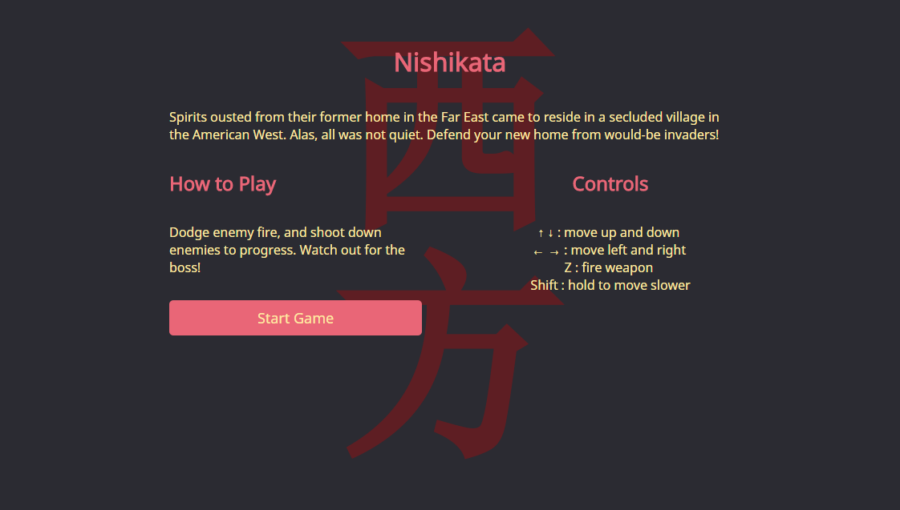
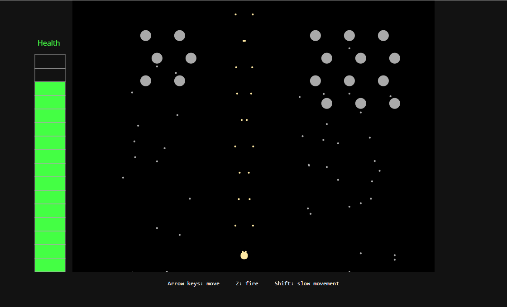
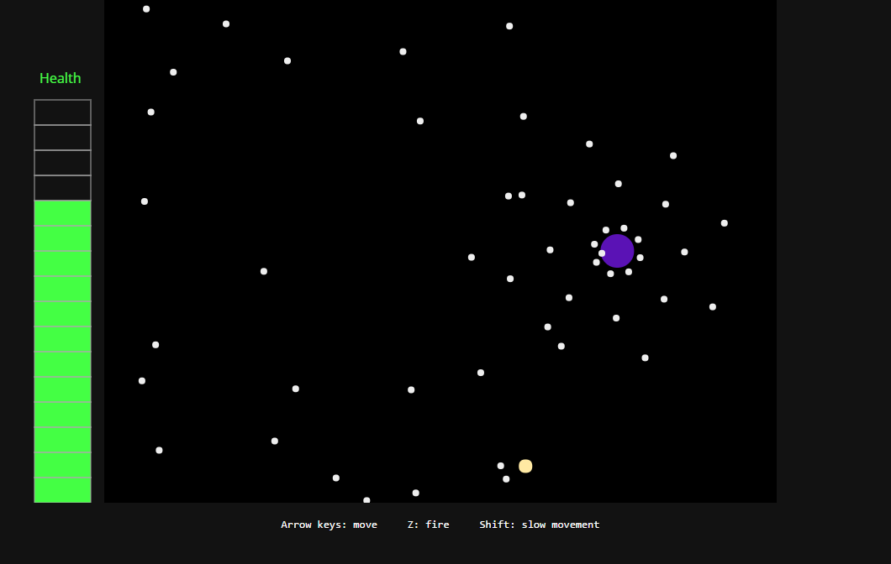

# Nishikata

Nishikata is a 2d shooter game inspired by games like Touhou and Phoenix, written with ES6 syntax and transpiled using Babel.

[Play now!](https://huoshengdi.github.io/Nishikata/)

## Screenshots







## Gameplay

The gameplay combines elements of the TI-83-based vertical shooter Phoenix with the geometric bullet patterns from Japanese "bullet hell" games like the Touhou series.

## Controls

* Arrow keys move your character
* Z fires your weapon
* Hold Shift to slow your movement for precision dodging

## Implementation

To maintain user experience across different machines and when under heavy CPU load, Nishikata calculates all movement and firing based on real time rather than locking it to the frame rate.
```javascript
main () {
  const now = Date.now();
  const dt = (now - this.lastTime) / 1000;
  const self = this;
  Game.step(dt);
  Game.draw(this.ctx);
  if (Game.isGameOver){
    this.stop();
    return gameAnimationId;
  }
  this.lastTime = now;
  gameAnimationId = requestAnimFrame(this.main.bind(self));
  return gameAnimationId;
}
```
This includes the logic used to make things move in patterns such as the sine wave bullets fired by the player:
```javascript
//wave_bullet.js
move(dt){
  let pos = this.pos;
  let vel = this.vel;
  const lifetime = Date.now() - this.startTime;
  //cycleSpeed is a bullet attribute determining how quickly the bullet cycles through the sine wave pattern
  const lifecycle = ((lifetime/1000)*this.cycleSpeed) % (2 * Math.PI);
  const newPos = [this.startPos[0]+vel[0]*Math.sin(lifecycle),pos[1]+vel[1]*dt];
  this.pos = newPos;
}
```
A simple vector transformation function eases the coding of bullet patterns:
```javascript
transform(vel, angle){
  const radians = (Math.PI/180) * angle,
    cos = Math.cos(radians),
    sin = Math.sin(radians),
    nx = (cos * vel[0]) + (sin * vel[1]),
    ny = (cos * vel[1]) + (sin * vel[0]);
  return [nx, ny];
}

//example: boss bullet pattern
const lifetime = Date.now() - this.startTime;
let bulletVels = [];
for (let i = 0; i < 8; i++){
  bulletVels.push(
    Util.transform([100,0], (45*i + (15 * lifetime) / 500) )
  );
}
```

## Planned Features

* Sprite graphics for enemies and the player character
* More levels and more enemies
* Scoring and character progression
